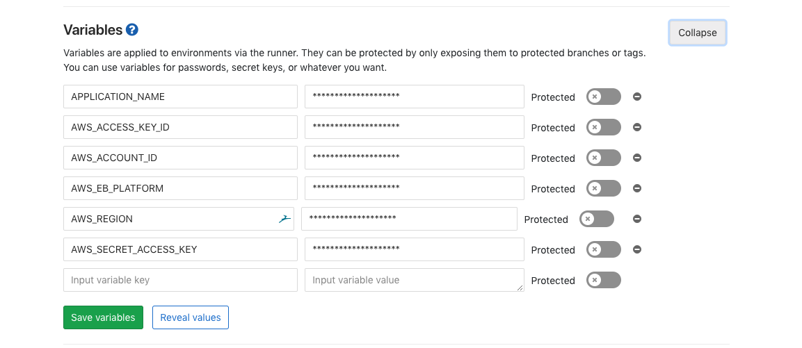

# Security as Code

Hi, if you ended up here, sorry. I really do.  As a geek and developer, I do not like to document things, nevertheless,  I think that this is a good opportunity to share the knowledge that I’ve acquired along the last years' thanks to different specialists and resources that I’ve found on the internet.
Keep in mind that the assets within this repository have been compiled and modified according to my needs. I’ll try to document everything, but won’t be that hard to understand what we are trying to accomplish.
Finally, the main goal is to provide a proof of concept, we are not seeking to replace the current incident and management response tools and strategy deployed at your organization, but complement what you already have.


## Getting Started
Machine Learning is a transformational technology that has been here for years, but now thanks to the computational capabilities are easier for companies and community develop intelligent agents such as chatbots, intelligent cars or recommendation algorithms such as the one that Amazon or Netflix use.
For this particular proof of concept, we will leverage AWS services and Gitlab CI/CD capabilities.

### Prerequisites
We will need the following items to partially or fully complete the PoC
* An AWS account  (The one with free tiers works)
* Basic knowledge on AWS services
* GitLab account
* Basic Python Knowledge
* Understand CI/CD and its benefits

### Setting up AWS account
We won’t go through all the details on how to create or harden an AWS account. You can find further information [Here](https://aws.amazon.com/es/iam/)

* Open the AWS console and in the services search bar type IAM
* Once there, select "users" in the menu bar located at the right of the screen and add a new user


* Add a new user and check the "Programmatic access" box


* For this PoC purposes give S3 and Lambda full access. Once created keep the Access Key and Secret Key information, we will use those two items when configuring our pipelines in GitLab.  Let’s move to Gitlab Configuration now.

## Setting up GitLab CI/CD
Now that you have set up your AWS service account, let's configure your GitLab CI/CD environment that will allow you to deploy your code straight into AWS.

* Login to [GitLab](http://gitlab.com/)
* Create a new project if you don’t have one already. The process is quite straightforward, just give it a name and define whether you want to keep it public or private.


* Once you repository has been created, open it and navigate to *Settings* and select *CI / CD* option.


* Scroll down to the *Variables* section and select *Expand*
* As a brief introduction, GitLab uses runners that allow us to deploy our code. We are able to invoke a docker instance, run some code and destroy it once our project has been successfully deployed. You can either install a runner in your machine or use the share resources. For this lab purposes, we will use GitLab/Google share resources. You can check this [LINK](https://docs.gitlab.com/ee/ci/) to further understand how pipelines works in GitLab.
* The Variables that we will set in here will be sent as parameters to our code in runtime. Why? because we don’t want to hardcode our credentials into our code, simple enough, right?. If you are familiar with Python, we will import the *os* library and invoke the `os.getenv`  function that will allows to manage these variables.




These are the list of variables that you must create. Remember the Access and Secret key information that you copied when setting up your AWS account? we will use it now.
Create the following items as shown in the above picture.
* APPLICATION_NAME  (Use to define the application name for EBS if needed, you need first to have an application and environment created)
* AWS_ACCESS_KEY_ID (The access key id copied in the previous step)
* AWS_ACCOUNT_ID (Your account id information, you can locate this number on the AWS console at the top right hand side of your screen, next to your user name)
* AWS_EB_PLATFORM (EBS platform that where you will deploy your code i.e. PHP, node, Python, etc)
* AWS_REGION (Your AWS region, go back to your AWS console and get your region, is located at the top right hand of your screen as welll)
* AWS_SECRET_ACCESS_KEY ( The secret key copied on the AWS setting step)

_Configuring your pipeline settings_

Now is time to build your CI/CD integration. Clone your repository in your machine and create one file `.gitlab-ci.yml` . You should use this name convention, The pipeline won’t work otherwise.

For this particular use case we will spin up an Elastic instance and enable GuardDuty. Boto3 allow you to manage almost every single AWS resource. For further reference, review [BOTO3 Documentation](https://boto3.amazonaws.com/v1/documentation/api/latest/index.html)

We won’t build different stages (i.e. Dev, Test, Production), We will deploy our infrastructure straight in production … don’t tell anybody 

You can use below code to create the yml file or download it from this repository.

```
image: docker:latest

before_script:
    - apk update # required to install zip
    - apk add zip # required for packaging up the application
    - apk add python
    - apk add python-dev
    - apk add py-pip
    - pip install boto3==1.9.25i

stages:
  - deploy

deploy:
  stage: deploy

  only:
    - master   # We will run the CD only when something is going to change in master branch.

  script:
    - python ./ec2.py #Deploy EC2 environment
    - python ./GuardDuty.py #Enable GuardDuty
  environment:
    name: master
```


* What we are doing here is creating a new docker instance, deploying python, it’s dependencies and BOTO3 as part of this image.
* Once the docker image is built, we call out the `ec2.py` script, which will create a new instance with detailed monitoring enable by default, and the `GuardDuty.py` script, which will enable GuardDuty. 
* Before running the job, make sure that the image id stored in the `ec2.py` script is valid. You can search for the image id within AWS console.
* Once the job has completed successfully, you should have a new EC2 instance deployed, GuardDuty enabled and for every single threat identified as positive, GD will send a notification to CloudWatch and depending on the rules that you have set, you can drop an email, or trigger a lambda function.


